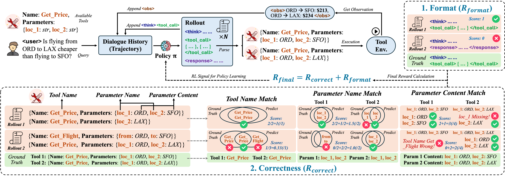

# ToolRL: Reward is All Tool Learning Needs
[**🤗 Model**](https://huggingface.co/collections/emrecanacikgoz/toolrl-680706679204ead5a6d44f58) | [**📊 Dataset**](https://github.com/qiancheng0/ToolRL/tree/main/dataset) | [**📖 Paper**](https://arxiv.org/pdf/2504.13958)



ToolRL is the code repository for paper "ToolRL: Reward is All Tool Learning Needs".

Our code is built upon [veRL](https://github.com/volcengine/verl) and [TinyZero](https://github.com/Jiayi-Pan/TinyZero).

---

## Reproduction (NYU Advanced Project)

This branch (`toolrl-reproduction`) contains our full reproduction of the ToolRL paper for Qwen2.5-1.5B and Qwen2.5-3B, including:
- Cold start GRPO and PPO training
- SFT baseline sweep (54 configs, 1.5B and 3B)
- Warm start GRPO and PPO (SFT400 → RL)
- API-Bank evaluation

### Our Results vs Paper (API-Bank Overall Accuracy)

#### Qwen2.5-1.5B
| Model | Paper | Ours |
|-------|-------|------|
| Raw (no training) | 30.65% | 31.32% |
| SFT400 | 53.60% | 53.77% |
| SFT400 + GRPO (warm) | 61.31% | 55.95% |
| SFT400 + PPO (warm) | 57.12% | 52.60% |
| GRPO Cold Start | 63.15% | 58.96% |
| PPO Cold Start | 40.54% | 56.28% |

#### Qwen2.5-3B
| Model | Paper | Ours |
|-------|-------|------|
| Raw (no training) | 51.59% | 53.27% (parser bug fixed) |
| SFT400 | 52.76% | 56.78% |
| SFT400 + GRPO (warm) | 62.48% | 54.61% |
| SFT400 + PPO (warm) | 65.16% | 59.46% |
| GRPO Cold Start | 67.00% | 62.98% |
| PPO Cold Start | 57.62% | 47.57% |

### BFCL Results (5 cells, paper-handler reruns)

| Model | Non-Live AST | Live | Multi-Turn | Irrelevance | Overall |
|-------|-------------|------|------------|-------------|---------|
| 1.5B PPO Cold | 81.27 | 67.21 | 1.25 | 27.90 | 18.14 |
| 3B PPO Cold | 84.12 | 71.35 | 8.50 | 71.51 | 25.76 |
| 1.5B GRPO Cold (original) | 77.25 | 64.69 | 2.00 | 12.50 | 17.55 |
| 1.5B GRPO Warm | 66.38 | 54.55 | 0.12 | 56.37 | 18.63 |
| 1.5B GRPO Cold (coarse reward) | 74.65 | 57.88 | 0.00 | 7.60 | 14.01 |

Paper Table 1 reports 79.40 Non-Live AST and 45.24 Live for 1.5B PPO Cold. Our Non-Live AST (81.27) is close; Live (67.21) is higher by ~22 points. Multi-Turn is low across all cells because this category is scored on single-turn models.

Score CSVs: `benchmarks/BFCL/results/bfcl_overall_2026-04-27.csv` and `bfcl_overall_2026-05-08.csv`.

### Infrastructure
- Cold start GRPO/PPO: 4x H100 80GB (KVM, Chameleon Cloud)
- SFT sweep + warm start: 4x A100 80GB (bare metal, CHI@UC)
- Experiment tracking: MLflow
- Docker image: `nvidia/cuda:12.1.0-devel-ubuntu22.04` base, vllm==0.6.3

---

## Running from Scratch (Full Command Reference)

Everything runs inside Docker. Follow these steps in order on a fresh GPU instance (4x H100, Ubuntu 22.04).

### Step 1 — Clone and create volumes

```bash
git clone https://github.com/Mario928/toolrl-verl-reproduction.git
cd toolrl-verl-reproduction

sudo docker volume create --name toolrl_hf_cache
sudo docker volume create --name toolrl_models
sudo docker volume create --name toolrl_mlflow_data
sudo docker volume create --name toolrl_datasets
```

### Step 2 — Build and start containers

Takes ~15-20 minutes the first time (builds the verl image).

```bash
sudo docker compose up -d --build
```

After this:
- Training container is named `verl`
- MLflow UI is at `http://<your-ip>:5000`

### Step 3 — Download the base models

```bash
sudo docker exec verl python3 -c "
from huggingface_hub import snapshot_download
snapshot_download('Qwen/Qwen2.5-1.5B-Instruct')
snapshot_download('Qwen/Qwen2.5-3B-Instruct')
"
```

### Step 4 — Run training

All commands run inside the `verl` container. Training logs to `/tmp/train.log` and MLflow.

**GRPO cold start, 1.5B** (~3.5 hours on 4x H100):
```bash
sudo docker exec -d verl bash -c '
    export CUDA_VISIBLE_DEVICES=0,1,2,3
    export N_GPUS=4
    export ROLLOUT_TP_SIZE=1
    export VLLM_ATTENTION_BACKEND=XFORMERS
    export WITHLENGTH=0 REFINEDREWARD=0 COARSEREWARD=0 STRICTMATCH=0
    export CORRECTMAX1=0 MAX1STEP30MAX3=0 SCHEDULEREWARD=0 SCHEDULELENGTH=0
    export DATA_DIR="./dataset/rlla_4k"
    export BASE_MODEL="Qwen/Qwen2.5-1.5B-Instruct"
    export EXPERIMENT_NAME="/app/models/toolrl-grpo-cold-qwen-1.5b"
    cd /workspace && bash ./examples/grpo_trainer/run_grpo.sh > /tmp/train.log 2>&1
'
```

**PPO cold start, 1.5B** (~4 hours):
```bash
sudo docker exec -d verl bash -c '
    export CUDA_VISIBLE_DEVICES=0,1,2,3
    export N_GPUS=4
    export ROLLOUT_TP_SIZE=1
    export VLLM_ATTENTION_BACKEND=XFORMERS
    export DATA_DIR="./dataset/rlla_4k"
    export BASE_MODEL="Qwen/Qwen2.5-1.5B-Instruct"
    export EXPERIMENT_NAME="/app/models/toolrl-ppo-cold-qwen-1.5b"
    cd /workspace && bash ./examples/ppo_trainer/run_ppo.sh > /tmp/train.log 2>&1
'
```

**GRPO cold start, 3B** (~7 hours):
```bash
sudo docker exec -d verl bash -c '
    export CUDA_VISIBLE_DEVICES=0,1,2,3
    export N_GPUS=4
    export ROLLOUT_TP_SIZE=2
    export VLLM_ATTENTION_BACKEND=XFORMERS
    export DATA_DIR="./dataset/rlla_4k"
    export BASE_MODEL="Qwen/Qwen2.5-3B-Instruct"
    export EXPERIMENT_NAME="/app/models/toolrl-grpo-cold-qwen-3b"
    cd /workspace && bash ./examples/grpo_trainer/run_grpo.sh > /tmp/train.log 2>&1
'
```

Check progress:
```bash
sudo docker exec verl tail -20 /tmp/train.log
```

To run all 4 cold start experiments sequentially:
```bash
sudo docker exec verl bash -c "cd /workspace && bash run_pipeline.sh"
```

### Step 5 — Evaluate on API-Bank

Run after training finishes. Replace the checkpoint path as needed.

```bash
# Generate outputs (~5 min for 597 questions)
sudo docker exec verl bash -c "
    cd /workspace/benchmarks/API-Bank &&
    WORLD_SIZE=4 python3 generate_batch.py \
      --model_paths /app/models/toolrl-grpo-cold-qwen-1.5b/actor/global_step_90
"

# Score
sudo docker exec verl bash -c "
    cd /workspace/benchmarks/API-Bank &&
    python3 evaluate.py \
      --model_paths /app/models/toolrl-grpo-cold-qwen-1.5b/actor/global_step_90
"
```

Results land in `benchmarks/API-Bank/PATH_TO_YOUR_SCORE_ROOT/` (that string is a literal directory name, not an env var).

### Step 6 — View MLflow

Open `http://<your-ip>:5000` in a browser. All training runs are logged automatically.

---

## Reward Variants

To run a reward ablation, set the flag before training:

```bash
export COARSEREWARD=1      # coarse reward — single pass/fail score (Section 5.3)
export REFINEDREWARD=1     # fine-grained reward — sub-scores for name, params, values (Section 5.3)
export WITHLENGTH=1        # settled length reward (Section 5.1)
export SCHEDULELENGTH=1    # dynamic length reward (Section 5.1)
export CORRECTMAX1=1       # equal max scale (Section 5.2)
export MAX1STEP30MAX3=1    # two-stage scale (Section 5.2)
export SCHEDULEREWARD=1    # smooth dynamic scale (Section 5.2)
```

Default (all flags 0) is the paper's original reward formulation.

---

## SFT Sweep (54 configs per model size)

```bash
# Run sweep
sudo docker exec verl bash -c "cd /workspace && bash sft_sweep.sh"      # 1.5B
sudo docker exec verl bash -c "cd /workspace && bash sft_sweep_3b.sh"   # 3B

# Evaluate all checkpoints
sudo docker exec verl bash -c "cd /workspace && bash sft_eval.sh"       # 1.5B
sudo docker exec verl bash -c "cd /workspace && bash eval_3b_sweep.sh"  # 3B
```

Best configs found: 1.5B → lr=5e-5, max_len=4096, epochs=5, batch=64 (53.77%) | 3B → lr=5e-5, max_len=4096, epochs=3, batch=32 (56.78%)

---

## Installation without Docker

```bash
pip install torch==2.4.0 --index-url https://download.pytorch.org/whl/cu121
pip install vllm==0.6.3
pip install ray
pip install -e .
pip install flash-attn --no-build-isolation
```

---

## Dataset

Processed parquet files are already in the repo (`dataset/rlla_4k/`). To regenerate from raw JSON:

```bash
# RL format (for GRPO/PPO) — run this inside the verl container
sudo docker exec verl bash -c "cd /workspace && python dataset/rlla_4k_raw/rlla.py"
```

> **Warning**: `dataset/rlla_4k/make_sft_parquet_4k.py` overwrites `dataset/rlla_4k/train.parquet` with SFT-format data. If you run it, re-run `rlla.py` before any GRPO/PPO training or it will crash at step 1 with `KeyError: 'reward_model'`.

---

## 🖊️ Citation
```text
@article{qian2025toolrl,
  title={ToolRL: Reward is All Tool Learning Needs},
  author={Qian, Cheng and Acikgoz, Emre Can and He, Qi and Wang, Hongru and Chen, Xiusi and Hakkani-T{\"u}r, Dilek and Tur, Gokhan and Ji, Heng},
  journal={arXiv preprint arXiv:2504.13958},
  year={2025}
}
```
